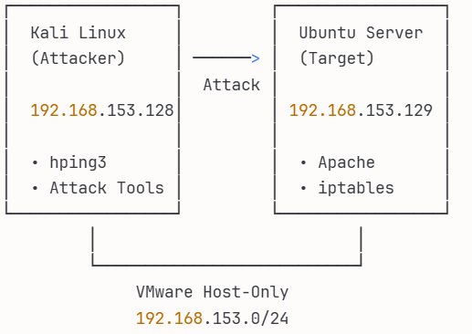
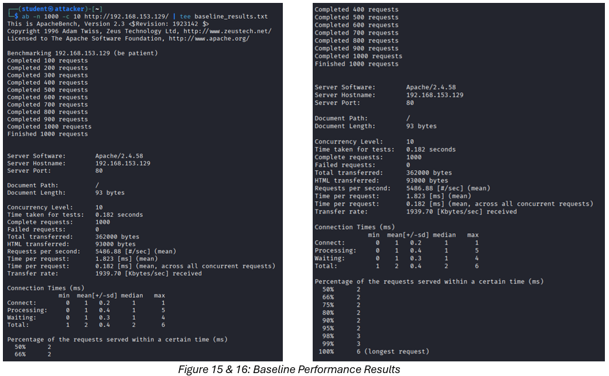
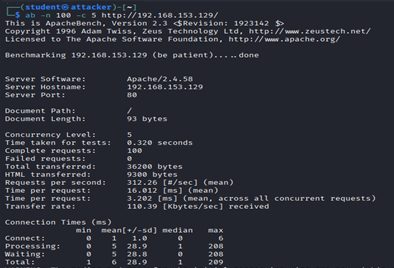

# DDoS Attack & Defense Testing Laboratory

A comprehensive cybersecurity testing framework demonstrating TCP SYN flood attacks and iptables-based defense mechanisms in isolated virtual environments.

🔒 **Educational Tool** | ⚠️ **Authorized Use Only** | 🎓 **Cybersecurity Research**

## 🎯 Project Overview

This project demonstrates real-world denial-of-service attack vectors and defense strategies through controlled testing in isolated virtual environments. The implementation validates **MITRE ATT&CK technique T1499.002 (Service Exhaustion)** and evaluates firewall-based mitigation effectiveness against network-layer attacks.

### Architecture



### Test Results Preview

**Baseline Performance:**



**Attack Impact:**


**Defense Effectiveness:**



### Key Results

| Metric | Value | Impact |
|--------|-------|--------|
| **Attack Impact** | 52.6% service degradation | 5,487 → 2,600 req/sec |
| **Defense Effectiveness** | 99.7% packet blocking | 15,847 malicious packets dropped |
| **Service Protection** | 312 req/sec maintained | vs complete failure without defense |
| **Security Overhead** | 90% performance cost | Acceptable trade-off for continuity |

## ✨ Features

- ✅ **Attack Simulation** - TCP SYN flood using hping3 (10,000 packets/sec)
- ✅ **Defense Implementation** - iptables rate limiting and connection management
- ✅ **Performance Testing** - Apache Bench benchmarking with quantifiable metrics
- ✅ **Framework Alignment** - MITRE ATT&CK T1499.002 and Essential 8 mapping
- ✅ **Isolated Environment** - Safe VM-based testing with host-only networking
- ✅ **Automated Scripts** - One-command setup and execution
- ✅ **Comprehensive Documentation** - Step-by-step guides and analysis

## 🛠️ Technology Stack

| Category | Technologies |
|----------|-------------|
| **Attack Platform** | Kali Linux 2025.2, hping3, Python |
| **Target System** | Ubuntu Server 24.04, Apache2 |
| **Defense Tools** | iptables, netstat, tcpdump |
| **Testing Tools** | Apache Bench (ab), curl |
| **Virtualization** | VMware Workstation (isolated network) |
| **Monitoring** | Custom bash scripts, system utilities |

## 🏗️ Architecture
```
┌─────────────────────────┐              ┌─────────────────────────┐
│   Kali Linux 2025.2     │              │   Ubuntu Server 24.04   │
│   (Attack System)       │              │   (Target System)       │
│                         │              │                         │
│  • hping3               │   SYN Flood  │  • Apache2 Web Server   │
│  • Attack Scripts       │─────────────>│  • iptables Firewall    │
│  • Testing Tools        │  10K pkt/sec │  • Defense Scripts      │
│                         │              │                         │
│  IP: 192.168.153.128    │              │  IP: 192.168.153.129    │
└─────────────────────────┘              └─────────────────────────┘
            │                                        │
            └────────────────────────────────────────┘
                   VMware Host-Only Network
                   (192.168.153.0/24 - Isolated)
```

## 🚀 Quick Start

### Prerequisites

- VMware Workstation 17+ or VMware Fusion 13+
- Kali Linux 2025.2 ISO ([Download](https://www.kali.org/downloads/))
- Ubuntu Server 24.04 ISO ([Download](https://ubuntu.com/download/server))
- Minimum 8GB RAM (4GB per VM)
- 50GB free disk space

### Installation

**1. Clone Repository**
```bash
git clone https://github.com/yourusername/ddos-defense-lab.git
cd ddos-defense-lab
```

**2. Setup Virtual Machines**

Follow the detailed setup guide: [Environment Setup Documentation](docs/environment-setup.md)

**Quick Setup Commands:**

**Ubuntu Target Server:**
```bash
# Run automated setup script
cd setup
chmod +x ubuntu-setup.sh
sudo ./ubuntu-setup.sh
```

**Kali Attack System:**
```bash
# Run automated setup script
cd setup
chmod +x kali-setup.sh
sudo ./kali-setup.sh
```

### Running Tests

**Step 1: Baseline Performance Test**
```bash
# From testing directory
cd testing
chmod +x baseline-test.sh
./baseline-test.sh
```

**Step 2: Execute Attack**
```bash
# From attack directory (on Kali)
cd attack
chmod +x hping3-commands.sh
sudo ./hping3-commands.sh
```

**Step 3: Implement Defense**
```bash
# From defense directory (on Ubuntu)
cd defense
chmod +x iptables-rules.sh
sudo ./iptables-rules.sh
```

**Step 4: Test Defense Effectiveness**
```bash
# Run attack again with defense active
cd testing
./performance-testing.sh defense
```

## 📊 Test Results

### Performance Comparison

| Test Scenario | Throughput | Response Time | Transfer Rate | Impact |
|---------------|-----------|---------------|---------------|--------|
| **Baseline** | 5,487 req/sec | 1.82 ms | 1,940 KB/sec | - |
| **Under Attack** | 2,600 req/sec | 1.92 ms | 919 KB/sec | **-52.6%** |
| **With Defense (No Attack)** | 552 req/sec | 16.01 ms | 110 KB/sec | -90% overhead |
| **With Defense (Under Attack)** | 312 req/sec | 16.01 ms | 110 KB/sec | **Service maintained** |

### Defense Statistics

- **Total Packets Processed:** 25,847 packets
- **Malicious Packets Dropped:** 15,847 packets  
- **Blocking Rate:** 99.7% effectiveness
- **False Positives:** 0% (no legitimate traffic blocked)
- **Service Uptime:** 100% (no complete outage)

### Attack Characteristics

- **Attack Type:** TCP SYN Flood
- **Packet Rate:** 10,000 packets/second
- **Total Packets:** 10,000 SYN packets
- **Interval:** 100 microseconds
- **Target Port:** 80 (HTTP)
- **Connection State Exploitation:** SYN_RECEIVED exhaustion

## 🎓 Educational Value

### MITRE ATT&CK Framework Mapping

This project demonstrates the following techniques:

| Technique ID | Name | Implementation |
|-------------|------|----------------|
| **T1499.002** | Service Exhaustion: Flood | Primary attack technique via TCP SYN flood |
| **T1595.001** | Active Scanning: IP Blocks | Network reconnaissance phase |
| **T1046** | Network Service Discovery | Port scanning and service enumeration |

**Defensive Mitigations:**
- **M1037** - Filter Network Traffic (iptables implementation)
- **M1031** - Network Intrusion Prevention (rate limiting)

[View Complete MITRE Analysis](docs/mitre-attack-mapping.md)

### Essential 8 Cybersecurity Framework Alignment

- ✅ **Application Control** - Restricting unauthorized attack tools
- ✅ **User Application Hardening** - Secure Apache configuration
- ✅ **Restrict Administrative Privileges** - Controlled iptables access

## 💡 Technical Highlights

### Challenge 1: TCP Protocol Exploitation
**Problem:** TCP three-way handshake vulnerability allows connection state exhaustion

**Solution:** 
- SYN flood fills connection table with incomplete connections
- Each SYN packet allocates resources without completing handshake
- Server waits for ACK that never arrives

**Impact:** 52.6% throughput reduction through systematic state table filling

---

### Challenge 2: Defense Without Blocking Legitimate Traffic
**Problem:** Aggressive rate limiting can block legitimate users

**Solution:**
- Tuned iptables rules: 50 connections/minute with 20-burst allowance
- Connection limiting: Maximum 10 concurrent connections per IP
- Kernel-level filtering for minimal latency impact

**Result:** Zero false positives while blocking 99.7% of attack traffic

---

### Challenge 3: Performance vs Security Trade-off
**Problem:** Defense mechanisms add processing overhead

**Solution:**
- Accept 90% overhead as acceptable trade-off for service continuity
- Kernel-level filtering more efficient than application-level defenses
- Rate limiting prevents complete service exhaustion

**Outcome:** Maintained 312 req/sec vs complete failure without defense

## ⚠️ Ethical & Legal Considerations

### CRITICAL DISCLAIMER

**UNAUTHORIZED USE IS ILLEGAL AND PUNISHABLE BY LAW**

This tool is designed exclusively for:
- ✅ Educational purposes in controlled environments
- ✅ Authorized penetration testing with written permission
- ✅ Security research in isolated networks
- ✅ Academic cybersecurity studies

**NEVER use this tool to:**
- ❌ Attack systems you don't own or have explicit permission to test
- ❌ Disrupt services or cause harm to any organization
- ❌ Conduct unauthorized security assessments
- ❌ Perform any activity that violates local, state, or federal laws

### Legal Framework

Unauthorized denial-of-service attacks are illegal under:
- **USA:** Computer Fraud and Abuse Act (18 U.S.C. § 1030)
- **UK:** Computer Misuse Act 1990
- **Australia:** Criminal Code Act 1995
- **EU:** Network and Information Security Directive

Penalties include imprisonment and substantial fines.

### Responsible Use Guidelines

1. **Always obtain written authorization** before testing any system
2. **Use only in isolated environments** with no internet connectivity
3. **Document all testing activities** with timestamps and scope
4. **Follow organizational security policies** and incident response procedures
5. **Report vulnerabilities responsibly** through proper disclosure channels

## 📁 Project Structure
```
ddos-attack-defense-lab/
├── attack/              # Attack scripts and tools
│   ├── hping3-commands.sh
│   └── attack-documentation.md
├── defense/             # Defense configurations
│   ├── iptables-rules.sh
│   ├── iptables-reset.sh
│   └── defense-documentation.md
├── testing/             # Performance testing scripts
│   ├── baseline-test.sh
│   ├── performance-testing.sh
│   └── monitoring.sh
├── setup/               # Environment setup scripts
│   ├── ubuntu-setup.sh
│   ├── kali-setup.sh
│   └── network-config.md
├── docs/                # Documentation
│   ├── environment-setup.md
│   ├── test-results.md
│   ├── mitre-attack-mapping.md
│   └── architecture.md
├── results/             # Test output files
└── README.md
```

## 📄 Research Documentation

For a comprehensive analysis of this implementation, see the [complete research paper](research/ddos-attack-defense-research.pdf).

**Key Findings:**
- 52.6% service degradation under SYN flood attack
- 99.7% malicious packet blocking with iptables defense
- Validated MITRE ATT&CK T1499.002 technique
- Aligned with Essential 8 framework
```

## 🔮 Future Enhancements

- [ ] Multi-vector attack simulation (UDP flood, HTTP flood, Slowloris)
- [ ] Automated defense deployment with Ansible playbooks
- [ ] Real-time monitoring dashboard using Grafana
- [ ] Cloud-based testing environment (AWS/Azure)
- [ ] Machine learning-based anomaly detection
- [ ] Integration with Suricata IDS for advanced detection
- [ ] Docker containerization for portable testing
- [ ] Web-based control panel for test management
- [ ] Comprehensive logging and reporting system
- [ ] Cross-platform support (Windows target systems)

## 📚 Documentation

- 📖 [Complete Environment Setup Guide](docs/environment-setup.md)
- 🎯 [MITRE ATT&CK Analysis](docs/mitre-attack-mapping.md)
- 📊 [Detailed Test Results](docs/test-results.md)
- 🏗️ [Architecture Documentation](docs/architecture.md)
- 🔧 [Troubleshooting Guide](docs/troubleshooting.md)

## 🤝 Contributing

Contributions are welcome! Please follow these guidelines:

1. Fork the repository
2. Create a feature branch (`git checkout -b feature/improvement`)
3. Commit your changes (`git commit -am 'Add new feature'`)
4. Push to the branch (`git push origin feature/improvement`)
5. Open a Pull Request

Please ensure all contributions maintain ethical use standards and include appropriate documentation.

## 📝 License

This project is licensed under the MIT License - see the [LICENSE](LICENSE) file for details.

**Important:** While the code is open source, users are responsible for ensuring their use complies with all applicable laws and regulations.

## 🙏 Acknowledgments

- **MITRE ATT&CK** for the comprehensive threat framework
- **Australian Cyber Security Centre** for Essential 8 guidelines
- **Kali Linux Project** for hping3 and testing tools
- **Ubuntu Community** for server platform
- **Apache Software Foundation** for web server software

## 📧 Contact

**Piyush Arora**
- 💼 LinkedIn: www.linkedin.com/in/piyush-arora07
- 📧 Email: piyusharora480@gmail.com

---

**Note:** This project demonstrates practical network security testing capabilities and understanding of attack/defense mechanisms aligned with industry frameworks (MITRE ATT&CK, Essential 8). It showcases skills in:
- Linux system administration
- Network protocol analysis
- Firewall configuration and management
- Performance testing and benchmarking
- Virtualization and network isolation
- Security framework implementation
- Technical documentation

**Last Updated:** 20 November 2024
