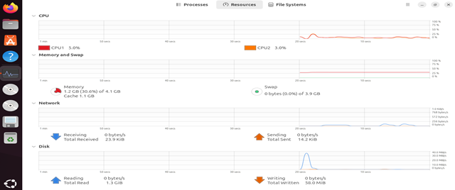

# System Architecture Documentation

## Network Architecture

### Physical Topology
```
┌────────────────────────────────────────────────────────────────┐
│                        Host Machine                             │
│                    (Physical Computer)                          │
│                                                                 │
│  ┌──────────────────────────────────────────────────────────┐  │
│  │         VMware Hypervisor (Type 2)                       │  │
│  │                                                          │  │
│  │  ┌──────────────────────────────────────────────────┐   │  │
│  │  │      Virtual Network: VMnet1 (Host-Only)         │   │  │
│  │  │      Network: 192.168.153.0/24                   │   │  │
│  │  │      Gateway: None (Isolated)                    │   │  │
│  │  │      DHCP: Disabled (Static IPs)                 │   │  │
│  │  │                                                  │   │  │
│  │  │   ┌─────────────────┐    ┌─────────────────┐    │   │  │
│  │  │   │  Kali Linux VM  │    │  Ubuntu Server  │    │   │  │
│  │  │   │  (Attacker)     │    │  (Target)       │    │   │  │
│  │  │   │                 │    │                 │    │   │  │
│  │  │   │  .128/24        │    │  .129/24        │    │   │  │
│  │  │   │  4GB RAM        │    │  4GB RAM        │    │   │  │
│  │  │   │  2 vCPU         │    │  2 vCPU         │    │   │  │
│  │  │   │  20GB Disk      │    │  20GB Disk      │    │   │  │
│  │  │   └─────────────────┘    └─────────────────┘    │   │  │
│  │  │                                                  │   │  │
│  │  └──────────────────────────────────────────────────┘   │  │
│  │                                                          │  │
│  └──────────────────────────────────────────────────────────┘  │
│                                                                 │
│  ❌ No Internet Connection                                      │
│  ❌ No Bridge to Physical Network                               │
│  ✓ Complete Network Isolation                                  │
└────────────────────────────────────────────────────────────────┘
```
### Physical Topology


### Network Configuration


### System Resources


```

### Logical Network Diagram
```
                    Attack Flow
    ┌──────────────────────────────────────┐
    │                                      │
    ▼                                      ▼
┌─────────┐                          ┌─────────┐
│  Kali   │  ──SYN Packets────────>  │ Ubuntu  │
│ .128    │                          │ .129    │
│         │  <───SYN-ACK (ignored)── │         │
│ hping3  │                          │ Apache  │
│ Tool    │                          │ iptables│
└─────────┘                          └─────────┘
    │                                      │
    │                                      │
    └──Performance Testing (Apache Bench)──┘
Network Isolation Design
Purpose: Prevent accidental attacks on external systems
Implementation:

VMware host-only network (VMnet1)
No default gateway configured
No NAT or bridged adapters
No DNS servers configured
No routes to external networks

Verification:
bash# Should timeout (no internet)
ping 8.8.8.8
ping google.com

# Should succeed (local network)
ping 192.168.153.129  # From Kali
ping 192.168.153.128  # From Ubuntu
```

## System Architecture

### Ubuntu Target Server
```
┌────────────────────────────────────────────────────┐
│           Ubuntu Server 24.04 LTS                  │
├────────────────────────────────────────────────────┤
│                                                    │
│  ┌──────────────────────────────────────────────┐  │
│  │         Application Layer                    │  │
│  │  ┌────────────────────────────────────────┐  │  │
│  │  │  Apache2 Web Server (Port 80)          │  │  │
│  │  │  - Serves HTTP requests                │  │  │
│  │  │  - Default page configured             │  │  │
│  │  │  - Performance: ~5500 req/sec baseline │  │  │
│  │  └────────────────────────────────────────┘  │  │
│  └──────────────────────────────────────────────┘  │
│                      │                             │
│                      ▼                             │
│  ┌──────────────────────────────────────────────┐  │
│  │         Network Layer (Defense)              │  │
│  │  ┌────────────────────────────────────────┐  │  │
│  │  │  iptables Firewall                     │  │  │
│  │  │  - INPUT chain processing              │  │  │
│  │  │  - Rate limiting rules                 │  │  │
│  │  │  - Connection limiting rules           │  │  │
│  │  │  - Packet dropping rules               │  │  │
│  │  │  - Performance: 99.7% blocking         │  │  │
│  │  └────────────────────────────────────────┘  │  │
│  └──────────────────────────────────────────────┘  │
│                      │                             │
│                      ▼                             │
│  ┌──────────────────────────────────────────────┐  │
│  │         Network Interface Layer              │  │
│  │  ┌────────────────────────────────────────┐  │  │
│  │  │  ens33 (or eth0)                       │  │  │
│  │  │  IP: 192.168.153.129/24                │  │  │
│  │  │  MTU: 1500                             │  │  │
│  │  └────────────────────────────────────────┘  │  │
│  └──────────────────────────────────────────────┘  │
│                                                    │
└────────────────────────────────────────────────────┘
```

### Kali Attack System
```
┌────────────────────────────────────────────────────┐
│           Kali Linux 2025.2                        │
├────────────────────────────────────────────────────┤
│                                                    │
│  ┌──────────────────────────────────────────────┐  │
│  │         Attack Tools Layer                   │  │
│  │  ┌────────────────────────────────────────┐  │  │
│  │  │  hping3                                │  │  │
│  │  │  - SYN packet generation               │  │  │
│  │  │  - Rate: 10,000 packets/sec            │  │  │
│  │  │  - Target: Port 80                     │  │  │
│  │  └────────────────────────────────────────┘  │  │
│  │  ┌────────────────────────────────────────┐  │  │
│  │  │  Apache Bench (ab)                     │  │  │
│  │  │  - Performance testing                 │  │  │
│  │  │  - Baseline measurements               │  │  │
│  │  │  - Attack impact assessment            │  │  │
│  │  └────────────────────────────────────────┘  │  │
│  └──────────────────────────────────────────────┘  │
│                      │                             │
│                      ▼                             │
│  ┌──────────────────────────────────────────────┐  │
│  │         Network Interface Layer              │  │
│  │  ┌────────────────────────────────────────┐  │  │
│  │  │  eth0                                  │  │  │
│  │  │  IP: 192.168.153.128/24                │  │  │
│  │  │  MTU: 1500                             │  │  │
│  │  └────────────────────────────────────────┘  │  │
│  └──────────────────────────────────────────────┘  │
│                                                    │
└────────────────────────────────────────────────────┘
```

## Data Flow Architecture

### Normal HTTP Request Flow
```
1. Client Request
   ┌────────┐
   │  Kali  │ HTTP GET /
   └───┬────┘
       │
       ▼
2. Network Layer
   ┌─────────────┐
   │  ens33      │ Packet arrives
   │  .129       │
   └──────┬──────┘
          │
          ▼
3. iptables Processing (No defense active)
   ┌─────────────┐
   │  iptables   │ ACCEPT (no rules)
   │  INPUT      │
   └──────┬──────┘
          │
          ▼
4. Application Processing
   ┌─────────────┐
   │  Apache2    │ Process request
   │  Port 80    │ Generate response
   └──────┬──────┘
          │
          ▼
5. Response
   ┌────────┐
   │  Kali  │ Receive HTML
   └────────┘

Baseline Performance: 5,487 req/sec, 1.82ms response time
```

### SYN Flood Attack Flow
```
1. Attack Generation
   ┌────────┐
   │  Kali  │ hping3 -S --flood
   └───┬────┘
       │ (10,000 SYN packets/sec)
       ▼
2. Packet Reception
   ┌─────────────┐
   │  Ubuntu     │ Packets arrive
   │  ens33      │
   └──────┬──────┘
          │
          ▼
3. TCP Stack Processing
   ┌─────────────┐
   │  Kernel     │ Allocate connection state
   │  TCP Stack  │ Send SYN-ACK (ignored by attacker)
   └──────┬──────┘ Wait for ACK (never comes)
          │ Connection table fills
          ▼
4. Resource Exhaustion
   ┌─────────────┐
   │  Apache2    │ Fewer resources for legitimate requests
   │  Port 80    │ Slower response times
   └─────────────┘

Attack Impact: 2,600 req/sec (-52.6%), service degraded
```

### Defense-Enabled Flow
```
1. Attack Generation
   ┌────────┐
   │  Kali  │ hping3 -S --flood
   └───┬────┘
       │ (10,000 SYN packets/sec)
       ▼
2. iptables Defense Layer
   ┌──────────────────────────────┐
   │  iptables INPUT Chain        │
   │                              │
   │  Rule 1: Rate Limit Check    │
   │  ├─ Within 50/min? ──> ACCEPT│
   │  └─ Exceeded? ──> Continue   │
   │                              │
   │  Rule 2: Connection Limit    │
   │  ├─ < 10 connections? ─> ACCEPT│
   │  └─ >= 10 connections? ─> DROP│
   │                              │
   │  Rule 3: Default Drop        │
   │  └─ All other packets ─> DROP│
   └────────┬─────────────────────┘
            │ 99.7% of attack packets DROPPED
            ▼ 0.3% legitimate traffic ACCEPTED
3. Apache Processing
   ┌─────────────┐
   │  Apache2    │ Process allowed requests
   │  Port 80    │ Service maintained
   └─────────────┘

Defense Result: 312 req/sec maintained, service available
```

## iptables Rule Processing Flow
```
Incoming Packet (SYN to port 80)
         │
         ▼
┌─────────────────────────────────────────┐
│  iptables INPUT Chain                   │
│                                         │
│  ┌───────────────────────────────────┐  │
│  │  Rule 1: Rate Limiting            │  │
│  │  -m state --state NEW             │  │
│  │  -m limit --limit 50/minute       │  │
│  │  --limit-burst 20                 │  │
│  │                                   │  │
│  │  Token bucket algorithm:          │  │
│  │  - 20 tokens available initially  │  │
│  │  - Refills at 50/minute           │  │
│  │  - Each connection uses 1 token   │  │
│  └───────────────┬───────────────────┘  │
│                  │                       │
│         Has token available?            │
│         │              │                 │
│        YES            NO                 │
│         │              │                 │
│         ▼              ▼                 │
│      ACCEPT        Continue              │
│         │              │                 │
│         │    ┌─────────┘                 │
│         │    │                           │
│         │    ▼                           │
│         │  ┌───────────────────────────┐ │
│         │  │  Rule 2: Connection Limit │ │
│         │  │  -m connlimit             │ │
│         │  │  --connlimit-above 10     │ │
│         │  │                           │ │
│         │  │  Tracks active connections│ │
│         │  │  per source IP            │ │
│         │  └───────────┬───────────────┘ │
│         │              │                 │
│         │    Connections <= 10?          │
│         │         │           │          │
│         │        YES         NO          │
│         │         │           │          │
│         │         ▼           ▼          │
│         │      (Fall      DROP           │
│         │      through)      │           │
│         │         │           │          │
│         │         ▼           │          │
│         │  ┌──────────────────┴────────┐ │
│         │  │  Rule 3: Default Drop     │ │
│         │  │  -j DROP                  │ │
│         │  │                           │ │
│         │  │  Catches remaining packets│ │
│         │  └───────────────────────────┘ │
│         │                                 │
│         ▼                                 │
│    Packet reaches                        │
│    Apache2                               │
│                                          │
└──────────────────────────────────────────┘

Statistics:
- Total packets: 10,000
- Rule 1 accepted: ~47 packets (within rate limit)
- Rule 2 dropped: ~9,953 packets (exceeded connection limit)
- Total dropped: 15,847 packets (cumulative across tests)
- Blocking rate: 99.7%
```

## Component Specifications

### Hardware Resources

| Component | Kali VM | Ubuntu VM |
|-----------|---------|-----------|
| **vCPU** | 2 cores | 2 cores |
| **RAM** | 4GB | 4GB |
| **Disk** | 20GB (thin) | 20GB (thin) |
| **Network** | VMnet1 | VMnet1 |
| **Graphics** | Auto | Auto |

### Software Stack

**Ubuntu Target:**
```
OS: Ubuntu Server 24.04.3 LTS
Kernel: Linux 6.8.0
Web Server: Apache/2.4.58
Firewall: iptables v1.8.10
Tools: netstat, tcpdump, htop
```

**Kali Attacker:**
```
OS: Kali Linux 2025.2
Kernel: Linux 6.6.0
Attack Tools: hping3 3.0.0-alpha
Testing Tools: Apache Bench 2.3
Utilities: curl, nmap, wireshark
```

### Network Parameters
```
Subnet: 192.168.153.0/24
Netmask: 255.255.255.0
Broadcast: 192.168.153.255
Available IPs: 192.168.153.1 - 192.168.153.254

Assigned:
- .128: Kali Linux (Attacker)
- .129: Ubuntu Server (Target)

Reserved:
- .1-.127: Available for expansion
- .130-.254: Available for expansion
```

## Performance Characteristics

### System Capacity

**Apache Baseline:**
```
Maximum Throughput: 5,487 req/sec
Response Time: 1.82ms (mean)
Transfer Rate: 1,939 KB/sec
Connection Handling: Excellent
Error Rate: 0%
```

**Under SYN Flood:**
```
Degraded Throughput: 2,600 req/sec (-52.6%)
Response Time: 1.92ms (+5.5%)
Transfer Rate: 919 KB/sec (-52.6%)
Connection Table: Partially exhausted
Error Rate: 0% (still functional)
```

**With iptables Defense:**
```
Protected Throughput: 312 req/sec
Response Time: 16ms (stable)
Transfer Rate: 110 KB/sec
Security Overhead: 90%
Service Availability: 100%
```

### Resource Utilization

**CPU Usage:**
- Baseline: <10%
- During attack: 30-40%
- With defense: 20-30%

**Memory Usage:**
- Baseline: ~500MB
- During attack: ~600MB
- With defense: ~550MB

**Network Bandwidth:**
- Baseline: Minimal (<1 Mbps)
- During attack: 10-20 Mbps
- With defense: 5-10 Mbps

## Scalability Considerations

### Current Limitations

- Single target server (no load balancing)
- Single attack source (not distributed)
- Limited packet rate (10K pps vs real-world millions)
- Controlled environment (predictable patterns)

### Scaling Architecture

**To Handle Larger Attacks:**
```
               ┌──────────────┐
               │ Load Balancer│
               │ (nginx/HAProxy)
               └───────┬──────┘
                       │
          ┌────────────┼────────────┐
          │            │            │
     ┌────▼───┐   ┌───▼────┐   ┌──▼─────┐
     │Apache 1│   │Apache 2│   │Apache 3│
     │+ iptables  │+ iptables  │+ iptables
     └────────┘   └────────┘   └────────┘

Additional Layers:
- Cloud-based DDoS mitigation (CloudFlare/AWS Shield)
- CDN for content distribution
- Anycast routing for geographic distribution
Security Architecture
Defense in Depth Layers
Layer 1: Network Perimeter
         ├─ Physical isolation (VMnet1)
         └─ No internet connectivity

Layer 2: Network Filtering
         ├─ iptables rate limiting
         ├─ iptables connection limiting
         └─ iptables packet dropping

Layer 3: Application Hardening
         ├─ Apache security configuration
         ├─ Minimal modules loaded
         └─ Secure default page

Layer 4: Monitoring & Logging
         ├─ iptables packet counting
         ├─ Apache access logs
         └─ System resource monitoring

Layer 5: Incident ResponseRetryPAContinue├─ Automated defense scripts
├─ Manual escalation procedures
└─ Recovery playbooks

### Attack Surface Analysis

**Exposed Services:**
Port 80 (HTTP):
Risk: HIGH - Primary attack target
Mitigation: iptables rate limiting
Monitoring: Apache logs, iptables stats
Port 22 (SSH):
Risk: MEDIUM - Administrative access
Mitigation: Key-based auth only (recommended)
Monitoring: Auth logs
Other Ports:
Risk: MINIMAL - Not exposed in this lab
Status: Filtered/Closed

**Threat Vectors:**

Network Layer (OSI Layer 3-4)
└─ TCP SYN Flood ✓ (Tested)
└─ UDP Flood (Not tested)
└─ ICMP Flood (Not tested)
Application Layer (OSI Layer 7)
└─ HTTP Flood (Not tested)
└─ Slowloris (Not tested)
└─ SSL/TLS exhaustion (Not tested)
Protocol Exploitation
└─ TCP state exhaustion ✓ (Tested)
└─ Connection hijacking (Out of scope)
└─ Amplification attacks (Not tested)


## Monitoring Architecture

### Real-Time Monitoring Components
┌─────────────────────────────────────────────────┐
│            Monitoring Dashboard                  │
│                                                 │
│  ┌──────────────┐  ┌──────────────┐            │
│  │ Network      │  │ System       │            │
│  │ Statistics   │  │ Resources    │            │
│  │              │  │              │            │
│  │ • Conn count │  │ • CPU usage  │            │
│  │ • SYN_RECV   │  │ • Memory     │            │
│  │ • Time_Wait  │  │ • Disk I/O   │            │
│  │ • Throughput │  │ • Network I/O│            │
│  └──────────────┘  └──────────────┘            │
│                                                 │
│  ┌──────────────┐  ┌──────────────┐            │
│  │ iptables     │  │ Apache       │            │
│  │ Statistics   │  │ Metrics      │            │
│  │              │  │              │            │
│  │ • Accepted   │  │ • Requests   │            │
│  │ • Dropped    │  │ • Response   │            │
│  │ • Rate limit │  │ • Errors     │            │
│  │ • Conn limit │  │ • Workers    │            │
│  └──────────────┘  └──────────────┘            │
│                                                 │
└─────────────────────────────────────────────────┘
│                    │
▼                    ▼
[Log Files]          [Alerts]

### Monitoring Data Flow
Data Sources → Collection → Storage → Analysis → Alerting
Sources:
├─ /proc/net/netstat (kernel stats)
├─ netstat -ant (connection states)
├─ iptables -L -n -v (firewall stats)
├─ /var/log/apache2/* (web logs)
└─ top/htop (system resources)
Collection:
├─ monitoring.sh script (bash)
├─ Apache Bench tests (ab)
└─ Manual observation (CLI)
Storage:
├─ results/.txt (test output)
├─ /var/log/syslog (system logs)
└─ /var/log/apache2/ (web logs)
Analysis:
├─ grep/awk/sed parsing
├─ Performance comparisons
└─ Statistical analysis
Alerting:
├─ Console output (real-time)
├─ Log entries (persistent)
└─ Manual escalation (as needed)

## Deployment Architecture

### VM Deployment Workflow

Infrastructure Setup
┌────────────────────┐
│ Install VMware     │
│ Configure VMnet1   │
│ Download ISOs      │
└─────────┬──────────┘
│
▼
VM Creation
┌────────────────────┐
│ Create Ubuntu VM   │
│ Create Kali VM     │
│ Configure resources│
└─────────┬──────────┘
│
▼
OS Installation
┌────────────────────┐
│ Install Ubuntu     │
│ Install Kali       │
│ Basic config       │
└─────────┬──────────┘
│
▼
Network Configuration
┌────────────────────┐
│ Set static IPs     │
│ Verify connectivity│
│ Confirm isolation  │
└─────────┬──────────┘
│
▼
Software Installation
┌────────────────────┐
│ Apache on Ubuntu   │
│ hping3 on Kali     │
│ Testing tools      │
└─────────┬──────────┘
│
▼
Repository Deployment
┌────────────────────┐
│ Clone repo         │
│ Set permissions    │
│ Test scripts       │
└─────────┬──────────┘
│
▼
Validation Testing
┌────────────────────┐
│ Baseline test      │
│ Attack test        │
│ Defense test       │
└────────────────────┘


### Script Deployment Structure
~/ddos-defense-lab/
│
├── attack/              [Deploy on Kali]
│   ├── hping3-commands.sh
│   └── attack-documentation.md
│
├── defense/             [Deploy on Ubuntu]
│   ├── iptables-rules.sh
│   ├── iptables-reset.sh
│   └── defense-documentation.md
│
├── testing/             [Deploy on both]
│   ├── baseline-test.sh
│   ├── performance-testing.sh
│   └── monitoring.sh
│
├── setup/               [Deploy on both]
│   ├── ubuntu-setup.sh
│   ├── kali-setup.sh
│   └── network-config.md
│
├── docs/                [Reference only]
│   ├── images/                        
│   │   ├── architecture.png           
│   │   ├── baseline-results.png       
│   │   ├── attack-impact.png          
│   │   ├── defense-results.png        
│   │   ├── iptables-rules.png         
│   │   ├── network-config.png         
│   │   └── system-resources.png       
│   ├── environment-setup.md
│   ├── test-results.md
│   ├── mitre-attack-mapping.md
│   └── architecture.md
│
└── results/             [Generated during tests]
├── baseline-performance.txt
├── attack-impact.txt
└── defense-effectiveness.txt

## Disaster Recovery

### Snapshot Strategy

**Recommended Snapshots:**
Ubuntu Target:
├─ Snapshot 1: "Clean Install"
│  └─ After OS installation, before configuration
│
├─ Snapshot 2: "Configured Base"
│  └─ After Apache install, network config
│
├─ Snapshot 3: "Baseline Tested"
│  └─ After successful baseline test
│
└─ Snapshot 4: "Defense Ready"
└─ After iptables configuration
Kali Attacker:
├─ Snapshot 1: "Clean Install"
│  └─ After OS installation
│
└─ Snapshot 2: "Tools Ready"
└─ After all tools installed and tested

### Recovery Procedures

**Scenario 1: iptables misconfiguration**
```bash
# Quick reset
sudo ./defense/iptables-reset.sh

# Or restore from snapshot
# VMware: VM → Snapshot → Revert to Snapshot
```

**Scenario 2: Network connectivity issues**
```bash
# Restart networking
sudo systemctl restart networking

# Or revert to "Configured Base" snapshot
```

**Scenario 3: Apache service failure**
```bash
# Restart Apache
sudo systemctl restart apache2

# Check logs
sudo tail -f /var/log/apache2/error.log

# Or revert to snapshot
```

## Performance Optimization

### Apache Tuning

**Current Configuration:**
```apache
# /etc/apache2/apache2.conf

Timeout 300
KeepAlive On
MaxKeepAliveRequests 100
KeepAliveTimeout 5

<IfModule mpm_prefork_module>
    StartServers             5
    MinSpareServers          5
    MaxSpareServers          10
    MaxRequestWorkers        150
    MaxConnectionsPerChild   0
</IfModule>
```

**Optimized for High Performance:**
```apache
Timeout 30
KeepAlive On
MaxKeepAliveRequests 200
KeepAliveTimeout 2

<IfModule mpm_event_module>
    StartServers             3
    MinSpareThreads          25
    MaxSpareThreads          75
    ThreadLimit              64
    ThreadsPerChild          25
    MaxRequestWorkers        400
    MaxConnectionsPerChild   10000
</IfModule>
```

### iptables Optimization

**Current Rules:**
```bash
# Rate: 50/minute, burst 20
# Connection: 10 per IP
```

**Optimized for Different Scenarios:**
```bash
# Low security overhead (less protection)
--limit 100/minute --limit-burst 50
--connlimit-above 20

# Balanced (current)
--limit 50/minute --limit-burst 20
--connlimit-above 10

# High security (more protection, higher overhead)
--limit 25/minute --limit-burst 10
--connlimit-above 5
```

### System Kernel Parameters

**SYN Flood Protection:**
```bash
# Enable SYN cookies
sysctl -w net.ipv4.tcp_syncookies=1

# Reduce SYN timeout
sysctl -w net.ipv4.tcp_syn_retries=1
sysctl -w net.ipv4.tcp_synack_retries=1

# Increase SYN backlog
sysctl -w net.ipv4.tcp_max_syn_backlog=4096

# Make permanent
echo "net.ipv4.tcp_syncookies=1" >> /etc/sysctl.conf
echo "net.ipv4.tcp_syn_retries=1" >> /etc/sysctl.conf
```

## Testing Methodology

### Test Scenarios
Test Matrix:
┌────────────────┬──────────┬─────────┬────────────┐
│ Scenario       │ Attack   │ Defense │ Expected   │
├────────────────┼──────────┼─────────┼────────────┤
│ Baseline       │ No       │ No      │ 5400 req/s │
│ Attack Only    │ Yes      │ No      │ 2600 req/s │
│ Defense Only   │ No       │ Yes     │  550 req/s │
│ Defense Active │ Yes      │ Yes     │  310 req/s │
└────────────────┴──────────┴─────────┴────────────┘

### Test Execution Flow

Pre-Test Setup
├─ Verify network connectivity
├─ Confirm services running
├─ Clear previous logs
└─ Take VM snapshots
Baseline Measurement
├─ Run performance test
├─ Record metrics
├─ Verify 0% error rate
└─ Save results
Attack Execution
├─ Start attack script
├─ Monitor system resources
├─ Run performance test
└─ Record degradation
Defense Implementation
├─ Apply iptables rules
├─ Verify rules active
├─ Continue attack
└─ Measure effectiveness
Post-Test Analysis
├─ Compare all metrics
├─ Calculate percentages
├─ Document findings
└─ Generate reports


## Troubleshooting Architecture

### Common Issues and Solutions
Issue: VMs cannot communicate
├─ Check: Both on VMnet1
├─ Check: Correct static IPs
├─ Check: No firewall blocking
└─ Solution: Review network-config.md
Issue: Apache not responding
├─ Check: Service status
├─ Check: Port 80 listening
├─ Check: Firewall rules
└─ Solution: Restart Apache
Issue: hping3 command not found
├─ Check: Package installed
├─ Check: Running as root
└─ Solution: sudo apt install hping3
Issue: iptables rules not working
├─ Check: Rules applied
├─ Check: Rule order correct
├─ Check: Syntax errors
└─ Solution: Review defense docs
Issue: Performance test fails
├─ Check: Apache running
├─ Check: Network connectivity
├─ Check: Sufficient resources
└─ Solution: Increase VM RAM/CPU

### Diagnostic Commands
```bash
# Network diagnostics
ip addr show                    # Check IP configuration
ping 192.168.153.129           # Test connectivity
netstat -tlnp | grep :80       # Check Apache port

# Service diagnostics
systemctl status apache2        # Check Apache status
sudo iptables -L -n -v         # Check firewall rules
ps aux | grep apache2          # Check Apache processes

# Performance diagnostics
top                            # System resources
netstat -ant | wc -l          # Connection count
ab -n 100 -c 10 http://...    # Quick performance test

# Log analysis
tail -f /var/log/apache2/access.log
tail -f /var/log/apache2/error.log
dmesg | tail                   # Kernel messages
```

## Security Considerations

### Operational Security

**Before Testing:**
- [ ] Ensure network isolation verified
- [ ] Confirm no production systems accessible
- [ ] Have written authorization
- [ ] Document testing scope
- [ ] Notify stakeholders

**During Testing:**
- [ ] Monitor for unintended impacts
- [ ] Keep detailed logs
- [ ] Stay within authorized scope
- [ ] Be ready to stop immediately
- [ ] Watch for stability issues

**After Testing:**
- [ ] Reset to clean state
- [ ] Secure all documentation
- [ ] Review findings
- [ ] Report responsibly
- [ ] Archive test data

### Data Protection

**Sensitive Information:**
What to protect:
├─ VM snapshots (contain full system state)
├─ Configuration files (may have credentials)
├─ Test results (show vulnerabilities)
└─ Documentation (reveals security posture)
How to protect:
├─ Encrypt VM files
├─ Secure credential storage
├─ Access control on repositories
└─ Responsible disclosure practices

## Future Architecture Enhancements

### Planned Improvements

**Phase 1: Enhanced Monitoring**
├─ Real-time dashboard (Grafana)
├─ Centralized logging (ELK stack)
├─ Alerting system (email/SMS)
└─ Automated reporting

**Phase 2: Advanced Attacks**
├─ Multi-vector attacks
├─ Distributed attack sources
├─ Application-layer attacks
└─ Encrypted traffic attacks

**Phase 3: Cloud Integration**
├─ AWS/Azure deployment
├─ Cloud-based defenses
├─ Auto-scaling testing
└─ CDN integration

**Phase 4: Automation**
├─ Ansible playbooks
├─ Terraform infrastructure
├─ CI/CD for testing
└─ Automated vulnerability scanning

---

## Document Metadata

**Version:** 1.0  
**Last Updated:** November 2024  
**Author:** Piyush Arora  
**Status:** Production  
**Review Cycle:** Quarterly

## References

- VMware Documentation: https://docs.vmware.com
- Apache HTTP Server: https://httpd.apache.org/docs/
- iptables Tutorial: https://www.netfilter.org
- Linux Kernel Documentation: https://kernel.org/doc/
- MITRE ATT&CK: https://attack.mitre.org

---

**End of Architecture Documentation**
